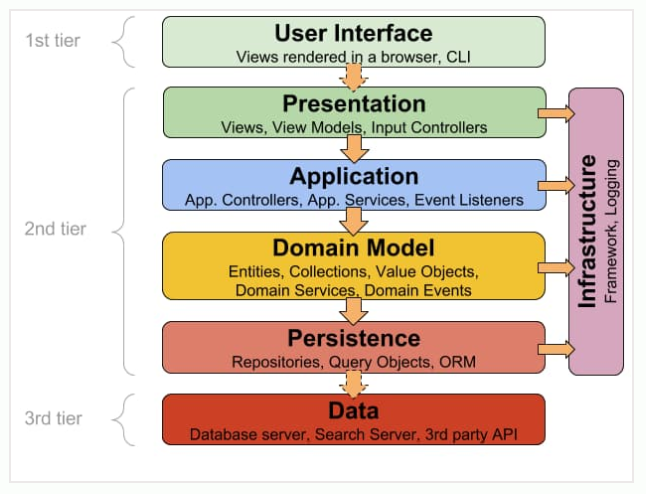

# Backend - Prueba Técnica Etikos

Este proyecto contiene el backend desarrollado en Node.js para la prueba técnica de Etikos Jardin
Azuayo. Implementa un sistema de autenticación robusto con 2FA, JWT, gestión de usuarios y auditoría.

## Stack Tecnológico
* Node.js
* TypeScript
* TypeORM
* MySQL 
* Twilio
* Nodemailer (con Gmail)
* JWT (JSON Web Tokens)
* Bcrypt

---

## Instrucciones para Ejecución Local

Siga estos pasos para levantar el proyecto en un entorno de desarrollo.

### Prerrequisitos
* Node.js (v18 o superior)
* NPM
* Tener una instancia de MySQL/SQL Server corriendo localmente.

---

### 1. Configuración de la Base de Datos en servidor smarterasp.net

1.  El codigo esta configurado para arrancar con esta base caso de usar una base local cambie la cadena de
conexion en el archivo data-source.ts

### 2. Configuración de la Base de Datos Local

1.  Cree una base de datos vacía en su gestor local (ej. `bdappjeffetikos`).
2.  Ejecute el backend por primera vez (paso 3). TypeORM creará la estructura de tablas automáticamente.
3.  Abrir el archivo `scripBaseDatos.txt` y copie el script y ejecute en su base para poblar las tablas de configuración (roles, tipos de OTP, etc.) 
---

### 2. Variables de Entorno

1.  Enviare un archivo `.env`de ejemplo con cuentas de prueba caso contrario usar cuentas propias 
2.  El archivo enviado coloquelo en la raiz del proyecto, el archivo `.env` contendra las variables requeridas
    * Un `JWT_SECRET` (puede ser cualquier string largo).
    * Sus credenciales de Twilio y Gmail (Contraseña de Aplicación).

---

### 3. Instalación y Ejecución

1.  Abra una terminal en la raíz de este proyecto.
2.  Instale las dependencias:
    npm install

3.  Inicie el servidor en modo de desarrollo:
    npm run start:dev
4.  El servidor estará corriendo en `http://localhost:3000`.

---

### 4. Credenciales de Prueba (Admin)

Para probar la funcionalidad de administrador se habilita un menu que solo podra ver el admin con las funcionalidades bloquear/desbloquear usuarios donde primero busca por cedula que se registro en la plataforma y procede a ver informacion del usuario y  el estado y la opcion de acuerdo al caso, use las siguientes credenciales:

* **Email:** `pruebaEtikos1@outlook.com` 
* **Password:** `Etikos12025#`

---

### 5. Arquitectura 

Arquitectura General del sistema 

Arquitectura del Backend 

